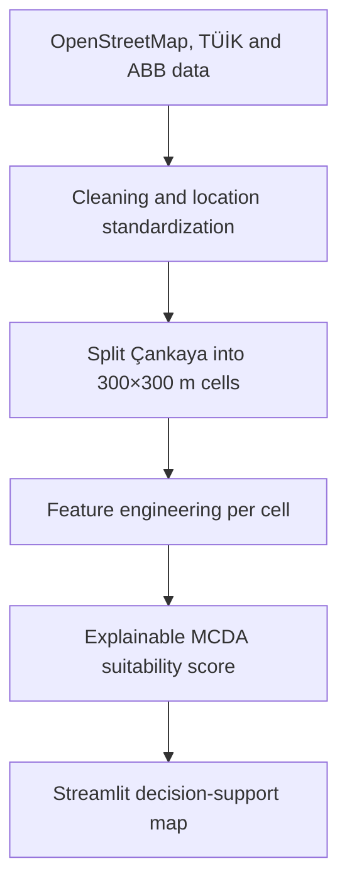

# Retail Location Intelligence

This project develops an explainable geospatial decision-support system that ranks potential café locations using accessibility, demand proxies, nearby amenities and market saturation.

It does **not** predict where a profitable café should be opened. There is no revenue, footfall, rent, or closure data.

**Scope:** Çankaya, Ankara · café as the target use · 300 m cells · OpenStreetMap + mahalle population as inputs.

## What this is (and is not)

This is a **data-driven, explainable café location decision-support map**.

A cell that already contains cafés is **not** labelled “good”. A cell without cafés is **not** labelled “bad”. Presence only means someone opened there; it is not a success outcome.

If a classifier is added later, its honest name is **existing café location similarity score** — “which cells look like places where cafés already exist?” — never “probability of a profitable café”.

Example readout:

> Bahçelievler 7. Cadde area: 82/100  
> Transit proximity: 91 · Potential demand: 85 · Complementary businesses: 76 · Competitor saturation: 58

## How it works



## Data sources

| Source | Use | Status |
| --- | --- | --- |
| **OpenStreetMap** via [OSMnx](https://osmnx.readthedocs.io/) | Boundary; cafés / restaurants; universities, schools, hospitals, parks, `shop=*`; bus stops, metro; walk ways and road intersections | In use |
| **TÜİK ADNKS** | Mahalle `pop_total` areal-weighted onto cells | In use (`pop_15_34` not available) |
| **Ankara Metropolitan Municipality** ([Şeffaf Ankara](https://www.ankara.bel.tr/)) | Social facilities, parks, Wi-Fi, transport assets | Planned |

OSM tags: `amenity=*` for cafés and restaurants, `shop=*` for retail. Polygons (campuses, large parks, hospitals) are reduced to centroids before counting.

## Project status

| Week | Focus | Status |
| --- | --- | --- |
| 1 | OSM backbone for Çankaya | Complete |
| 2 | 300 m grid and spatial features | Complete |
| 3 | Weighted suitability score + explanation UI | Complete |
| 4 | Optional café-*similarity* models (not profit) | Deferred |
| 5 | Filters, cell inspector, sensitivity in-app, deploy prep | Complete |

## Quick start

Requires Python 3.10+ (geospatial wheels are more reliable on 3.11–3.12).

```bash
cd retail-location-intelligence
python -m venv .venv

# Windows PowerShell
.venv\Scripts\Activate.ps1

# macOS / Linux
# source .venv/bin/activate

pip install -r requirements.txt
python -m src.collect_osm_data
python -m src.build_features
python -m src.attach_streets   # if the feature grid already exists
python -m src.scoring
streamlit run app.py
```

The collector writes layer files under `data/raw/`. Scoring writes `data/processed/cankaya_grid_scored.*` and refreshes `images/suitability-map.png`. The app scores the feature grid live when you move the weight sliders.

`data/processed/cankaya_grid_features.parquet` is the compact matrix the Streamlit app needs. Raw OSM GeoJSON stays local (large, Overpass). Without the parquet, run `python -m src.collect_osm_data` then `python -m src.build_features`.

## Deploy (Streamlit Community Cloud)

1. Push the repo (including `cankaya_grid_features.parquet` and `cankaya_boundary.geojson`).
2. [share.streamlit.io](https://share.streamlit.io) → New app → `app.py`.
3. Python 3.11 or 3.12. `packages.txt` installs GDAL for GeoPandas on Linux.

The cloud app can show the suitability map from the parquet even if raw POI layers are not committed. OSM overlay mode needs the local GeoJSON files or a fresh collect.

```bash
python -m src.collect_osm_data           # POIs + drive/walk graphs
python -m src.collect_osm_data --pois-only
python -m src.collect_osm_data --networks-only
```

On Windows, if the console is not UTF-8, run:

```powershell
$env:PYTHONIOENCODING='utf-8'
```

Week 1 OSM backbone (Çankaya):

| Layer | Count | OSM |
| --- | ---: | --- |
| Cafés | 427 | `amenity=cafe` |
| Restaurants / fast food | 665 | `amenity=restaurant`, `fast_food` |
| Universities | 61 | `amenity=university` |
| Schools | 245 | `amenity=school` |
| Hospitals / clinics | 98 | `amenity=hospital`, `clinic` |
| Parks | 547 | `leisure=park` |
| Shops | 1,446 | `shop=*` |
| Bus stops | 1,455 | `highway=bus_stop` |
| Metro / stations | 125 | `railway=subway_entrance`, `station` |
| Road intersections | 12,687 | drive graph, `street_count >= 3` |
| Walk ways | 81,450 | walk graph edges |


## Scoring

Each cell gets five 0–1 pillars (Min–Max scaled features), then a weighted sum:

\[
\text{Suitability} = 100 \times (0.30D + 0.25A + 0.20P + 0.15T + 0.10S)
\]

| Pillar | Weight | Built from |
| --- | ---: | --- |
| **D** potential demand | 30% | Universities, shops, POI diversity, parks, schools |
| **A** accessibility | 25% | Bus stops, inverse metro distance, road intersections |
| **P** population | 20% | Areal-weighted mahalle density |
| **T** complementary businesses | 15% | Restaurants and shops (not cafés) |
| **S** opportunity vs saturation | 10% | Invert \(\text{cafés} / (\text{demand proxy} + 1)\) |

Saturation is **relative**. A cell with no cafés and no demand does not rank as a perfect gap. A busy street with few mapped cafés ranks higher.

The Streamlit sidebar lets you change the mix; weights are re-normalised to 100%. The app also has a ±10 percentage-point one-at-a-time sensitivity table (Spearman rank correlation and top-50 overlap versus the default mix). The same table is printed by `python -m src.scoring`.

Inspect a cell via **mahalle filter**, **cell dropdown / number**, or the **top-10 table**. The selected cell is outlined in yellow. PyDeck hover shows pillar scores; a map click does not feed back into Streamlit. Street names are the nearest named OSM way within 250 m — a label, not a model feature.

### Why these default weights?

They are a **stated prior** for a convenience café, not coefficients fitted to profit.

Retail location MCDA and gravity / Huff-style models usually put catchment activity first and access second. Population is real demand but our table is mahalle-level, so it is not allowed to dominate. Complementary mixed-use (restaurants, shops) supports agglomeration. Competition is included but down-weighted, because missing cafés often mean missing demand, and OSM café counts are incomplete.

If a reviewer prefers 35% demand / 25% access, that is a neighbouring prior: move the sliders; ranks should stay broadly stable if the sensitivity overlap stays high.

## Optional modelling (later)

A Random Forest (or logistic regression) on “cell has ≥1 café” would learn **where cafés already are**, not **where a new café would earn money**. Keep it, if at all, as a comparison layer named **existing café location similarity**. Evaluate with neighbourhood-held-out splits so adjacent cells do not leak into the test set. Never report that output as success probability.

## Limitations

- **Demand is a proxy.** Mahalle `pop_total` is spread onto 300 m cells by overlap area. Age 15–34 was not published at mahalle level in the extract we used.
- **Sakarya Mahallesi** has no `pop_total` in the table, so those cells stay unmatched for population.
- **OSM completeness varies.** Çankaya is relatively well mapped, but missing cafés and stops still exist.
- **No commercial outcome labels.** Suitability is a multi-criteria score, not a forecast of profit.
- **First version is Çankaya-only.**

## Repository layout

```text
retail-location-intelligence/
├── README.md
├── app.py
├── requirements.txt
├── LICENSE
├── src/
│   ├── collect_osm_data.py
│   ├── create_grid.py
│   ├── build_features.py
│   ├── scoring.py
│   ├── attach_streets.py
│   └── visualization.py
├── data/raw | processed
├── notebooks/
├── models/
└── images/
```

## License

MIT. OpenStreetMap data is © OpenStreetMap contributors and used under the ODbL.
