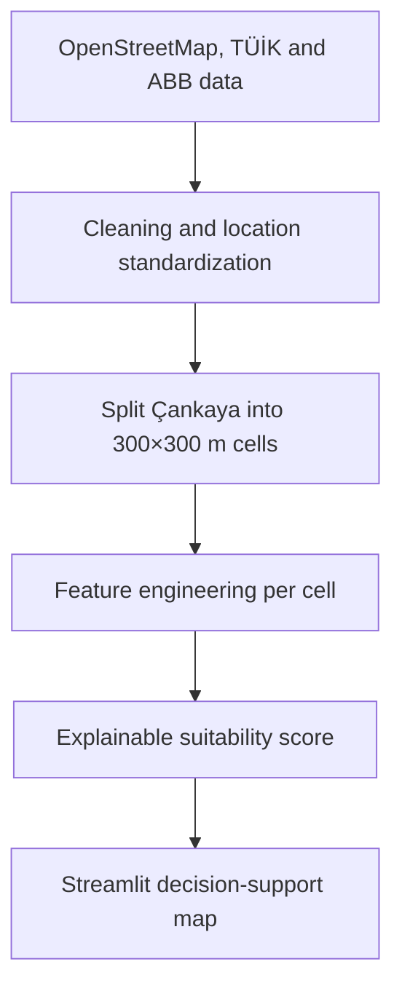
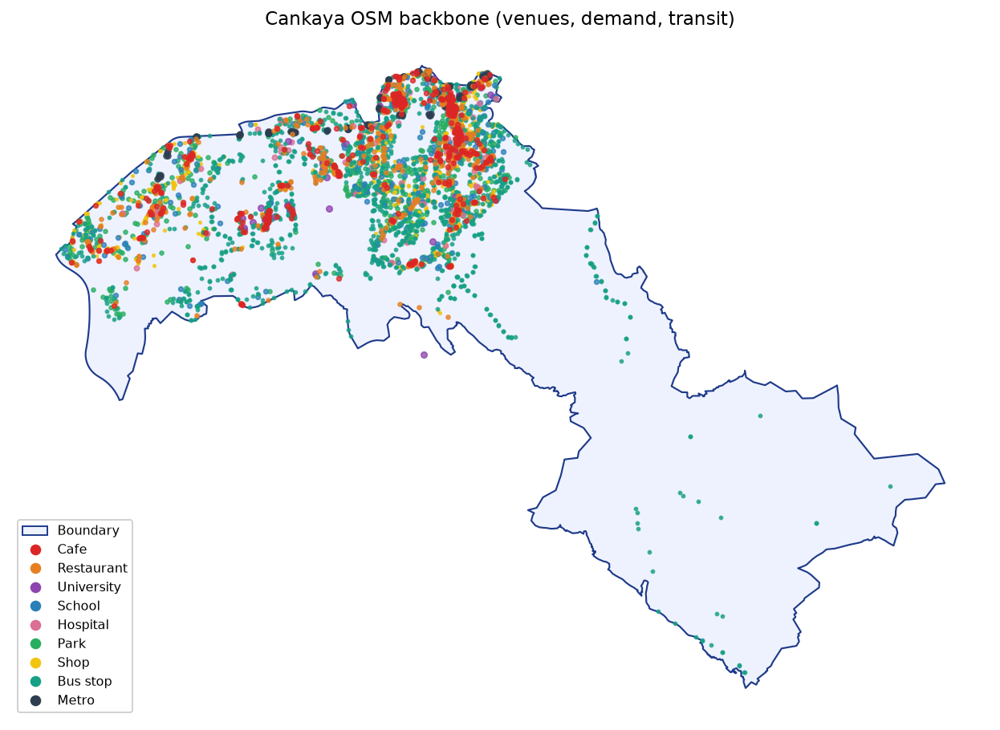

# Retail Location Intelligence

This project develops an explainable geospatial decision-support system that ranks potential café locations using accessibility, demand proxies, nearby amenities and market saturation.

**Scope (v0.1):** Çankaya, Ankara · OpenStreetMap backbone (target businesses, demand generators, transit and street/walk network). Suitability scoring and 300 m grids come later.

## What this is (and is not)

This is a **decision-support map**, not a profitability model. We do **not** claim to predict where a profitable café should be opened. There is no revenue, footfall, rent, or closure data in the first version.

Current output: OSM backbone plus a 300 m analysis grid with POI counts, metro distance, and mahalle population spread by overlapping area. Age 15–34 is not in the first TÜİK extract.

Later output (Week 3+): a 0–100 suitability score per cell, with explainable components such as:

> Bahçelievler 7. Cadde area: 82/100  
> Transit proximity: 91 · Potential demand: 85 · Complementary businesses: 76 · Competitor saturation: 58

## How it works



## Data sources

| Source | Use | Status |
| --- | --- | --- |
| **OpenStreetMap** via [OSMnx](https://osmnx.readthedocs.io/) | Boundary; cafés / restaurants; universities, schools, hospitals, parks, `shop=*`; bus stops, metro; walk ways and road intersections | Week 1 backbone |
| **Ankara Metropolitan Municipality** ([Şeffaf Ankara](https://www.ankara.bel.tr/)) | Social facilities, parks, Wi-Fi, transport assets | Planned |
| **TÜİK ADNKS** | Mahalle `pop_total` areal-weighted onto cells | Week 2 (`pop_15_34` not available) |

OSM tags follow common conventions: `amenity=*` for cafés and restaurants, `shop=*` for retail. Polygons (campuses, large parks, hospitals) are reduced to centroids before counting.

## Project status

| Week | Focus | Status |
| --- | --- | --- |
| 1 | OSM backbone for Çankaya (venues, demand, transport, networks) | Complete |
| 2 | 300 m grid and spatial features | Complete |
| 3 | Weighted suitability score | Not started |
| 4 | Location-similarity models (not profit models) | Not started |
| 5 | Streamlit filters, ranking table, documentation | Not started |

## Quick start

Requires Python 3.10+ (geospatial wheels are more reliable on 3.11–3.12).

```bash
cd retail-location-intelligence
python -m venv .venv

# Windows PowerShell
.venv\Scripts\Activate.ps1

# macOS / Linux
# source .venv/bin/activate

pip install -r requirements.txt
python -m src.collect_osm_data
streamlit run app.py
```

The collector writes layer files under `data/raw/`. Streamlit toggles OSM groups on the map. Re-running hits Overpass; keep a local copy once it succeeds.

```bash
python -m src.collect_osm_data           # POIs + drive/walk graphs
python -m src.collect_osm_data --pois-only
python -m src.collect_osm_data --networks-only
```

On Windows, if the console is not UTF-8, run:

```powershell
$env:PYTHONIOENCODING='utf-8'
```

Week 1 OSM backbone (Çankaya):

| Layer | Count | OSM |
| --- | ---: | --- |
| Cafés | 427 | `amenity=cafe` |
| Restaurants / fast food | 665 | `amenity=restaurant`, `fast_food` |
| Universities | 61 | `amenity=university` |
| Schools | 245 | `amenity=school` |
| Hospitals / clinics | 98 | `amenity=hospital`, `clinic` |
| Parks | 547 | `leisure=park` |
| Shops | 1,446 | `shop=*` |
| Bus stops | 1,455 | `highway=bus_stop` |
| Metro / stations | 125 | `railway=subway_entrance`, `station` |
| Road intersections | 12,687 | drive graph, `street_count >= 3` |
| Walk ways | 81,450 | walk graph edges |



## Scoring (from Week 3)

Cells will be scored with an explainable weighted sum after Min–Max scaling:

\[
\text{Suitability} = 100 \times (0.30D + 0.25A + 0.20P + 0.15T + 0.10S)
\]

- **D** demand proxy (POI mix, universities, shops)
- **A** accessibility (bus stops, metro distance)
- **P** population density proxy
- **T** complementary businesses (restaurants, retail)
- **S** inverted saturation: cafés / (demand + 1), not “zero cafés = best”

Week 4 models, if added, answer only: *which cells look like places where cafés already exist?* Call that an **existing café location similarity score**, never a success probability.

## Limitations

- **Demand is a proxy.** Mahalle `pop_total` is spread onto 300 m cells by overlap area. Age 15–34 was not published at mahalle level in the extract we used, so café-age demand uses total population plus OSM activity.
- **Sakarya Mahallesi** has no `pop_total` in the table, so those cells stay unmatched for population.
- **OSM completeness varies.** Çankaya is relatively well mapped, but missing cafés and stops still exist.
- **No commercial outcome labels.** Suitability is a multi-criteria score, not a forecast of profit.
- **First version is Çankaya-only.** The business question is still café siting, but the map stores restaurants, demand POIs and the transport network as scoring inputs.

## Repository layout

```text
retail-location-intelligence/
├── README.md
├── app.py
├── requirements.txt
├── LICENSE
├── src/
│   ├── collect_osm_data.py
│   ├── create_grid.py
│   ├── build_features.py
│   ├── scoring.py
│   └── visualization.py
├── data/raw | processed
├── notebooks/
├── models/
└── images/
```

## License

MIT. OpenStreetMap data is © OpenStreetMap contributors and used under the ODbL.
