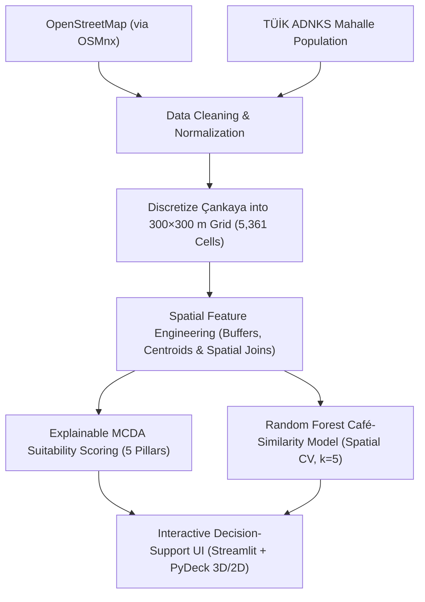

# Retail Location Intelligence

**An Explainable Geospatial Decision-Support System for Café Site Selection in Çankaya, Ankara**

This project develops an explainable, data-driven geospatial decision-support system that evaluates and ranks potential café locations across Çankaya, Ankara using open geographic data (OpenStreetMap) and demographic data (TÜİK ADNKS).

> ⚠️ **What this project is NOT:**  
> This system is **not a revenue forecasting or commercial success prediction model**. The dataset does not contain sales turnover, profit margins, rental rates, foot traffic counts, or business closure history. The objective is not to guarantee financial profitability, but to provide urban planners, retail analysts, and entrepreneurs with a transparent, explainable spatial scoring matrix grounded in accessibility, potential demand, population density, and market saturation.

---

## 📌 Core Philosophy & Methodology

- **Presence $\neq$ Profitability:** The presence of existing cafés in a cell does not imply that those businesses are profitable or well-run. Conversely, a cell without cafés is not inherently a poor location or an unexploited commercial opportunity.
- **Dual-Layer Evaluation Framework:**
  1. **Explainable Multi-Criteria Decision Analysis (MCDA):** A transparent scoring engine with user-selected scenario weights, combining demand, access and population with restaurant-saturation and café-competition penalties (0–100 scale). Huff/gravity concepts provide context; the code does not implement a Huff choice-probability model or validate its weights against commercial outcomes.
  2. **Café-Location Similarity Classifier (Random Forest):** A machine learning model trained using spatial cross-validation to answer: *"To what extent does this location resemble areas where cafés typically operate?"*

---

## 🏗️ System Architecture & Workflow


```mermaid
flowchart TD
    A["OpenStreetMap (via OSMnx)"] --> B["Data Cleaning & Normalization"]
    T["TÜİK ADNKS Mahalle Population"] --> B
    B --> C["Discretize Çankaya into 300×300 m Grid (5,361 Cells)"]
    C --> D["Spatial Feature Engineering (Buffers, Centroids & Spatial Joins)"]
    D --> E["Explainable MCDA Suitability Scoring (5 Pillars)"]
    D --> F["Random Forest Café-Similarity Model (Spatial CV, k=5)"]
    E --> G["Interactive Decision-Support UI (Streamlit + PyDeck 3D/2D)"]
    F --> G
```

---

## 📊 Data Sources

| Source | Role / Usage | Coverage & Details |
| --- | --- | --- |
| **OpenStreetMap (OSMnx)** | District boundaries; target use (`amenity=cafe`); restaurants/fast food; universities, schools, hospitals, parks, retail (`shop=*`); bus stops, subway stations, pedestrian/drive street networks | Active (10+ thematic layers) |
| **TÜİK ADNKS** | Neighborhood-level (`mahalle`) total population distributed across 300 m cells via areal weighting | Active (with areal median density imputation for unmapped units) |
| **Ankara Metropolitan Municipality ([Şeffaf Ankara](https://www.ankara.bel.tr/))** | EGO public transit boardings, route frequencies, municipal Wi-Fi access points, social infrastructure | Planned roadmap integration |

*Note: Large polygonal geometries (university campuses, municipal parks, hospital compounds) are collapsed to geometric centroids prior to radius-based spatial aggregations.*

---

## 📅 Project Milestones & Status

| Phase | Core Objective | Status |
| :---: | :--- | :---: |
| **Week 1** | OpenStreetMap data extraction pipeline and POI taxonomy for Çankaya | ✅ Complete |
| **Week 2** | 300 m square grid generation and spatial buffer feature engineering | ✅ Complete |
| **Week 3** | Weighted suitability scoring engine (MCDA), sensitivity analysis & UI explanation | ✅ Complete |
| **Week 4** | Random Forest café-similarity model (with spatial group cross-validation) | ✅ Complete |
| **Week 5** | Interactive PyDeck visualizer, dynamic filtering, automated test suite, Docker & GitHub Actions CI | ✅ Complete |

---

## 2.0

The app opens on **Temel Kullanım**, loaded from `docs/temel_kullanim.md`.
Sidebar order: Temel Kullanım → Verileri Güncelle → Kapsam → Harita ve bölge → Puan Ağırlıkları → Min uygunluk → OSM Katmanları.
Çankaya café analysis is active; restaurant analysis is marked “yakında”. Multiple neighbourhoods can be selected. The cell picker is hidden on the OSM point map.

### Scoring

All components are 0–100. Default score:

`max(0, (0.45*Demand + 0.25*Access + 0.20*Population)/0.90 - 0.03*Saturation - 0.07*Competition)`

Positive contributions are divided by their own weight total; penalties retain their configured magnitudes. Scores are clipped to 0–100. The theoretical maximum is 100, without stretching observed results after filtering. These are user-selected scenario weights, not fitted or literature-validated coefficients.

- **Demand (45%)** merges the former demand/complementary components. It uses universities, shops, schools, parks, offices, government offices and kindergartens. Cafés, restaurants and café-containing POI diversity are excluded. Subweights and missing-data handling are documented on the home page. Office counts do not measure white-collar workers. New school counts use explicit ISCED 2/3 tags; unknown levels are excluded and disclosed. The legacy dataset uses generic school counts until refreshed.
- **Access (25%)** retains bus stops, metro proximity and road intersections.
- **Population (20%)** retains areal-weighted residential population.
- **Saturation (negative 3%)** uses restaurants/fast food within 500m, MinMax-scaled across the whole district before filtering. Constant zero counts mean no pressure; constant positive counts mean full pressure.
- **Competition (negative 7%)** uses distinct café counts in the centre, 3×3 and 5×5 blocks. Thresholds ≥2/≥6/≥13 produce 0/1/2/3 warnings, and penalties 0/2.33/4.67/7 points. Counts are not summed across nested blocks. District-edge coverage is displayed.
- **Popularity–venue compatibility (planned 10%)** is disabled and marked “veri yok”. No synthetic popularity data is added; it has no effect on suitability.

The competition and restaurant-saturation maps show pressure, not profitability. The committed feature dataset lacks raw café coordinates and new demand layers. Until **Verileri Güncelle** succeeds, missing penalties are not computed and scores are visibly provisional; missing demand layers are listed. Refresh downloads OSM, rebuilds features, clears caches, and restores the previous local dataset if the process fails. It requires working Overpass/geocoding access. Missing files are not interpreted as genuine zero-count layers.

## 🤖 Random Forest Café-Similarity Model (Week 4)

To complement the deductive MCDA score with inductive machine learning, a secondary comparison model was developed:

- **Objective:** Quantify how closely a cell's spatial attributes match typical café locations (`cafe_similarity_score`, 0–100).
- **Target Formulation:** Binary label `cafes_500m >= 1`. *Existing café counts are excluded. POI diversity is recomputed without cafés even when the stored legacy diversity includes them. Missing-value medians are fitted within each training fold.*
- **Spatial Validation:** Standard K-Fold splits suffer from spatial autocorrelation leakage (neighboring cells sharing similar feature spaces). We employ **Stratified Group 5-Fold Cross-Validation** grouped on `mahalle_name`, ensuring entire neighborhoods are held out during testing. Nearby cells across neighborhood boundaries can still share buffers and spatial dependence; these folds do not eliminate all spatial leakage.
- **Displayed Score:** 100 × out-of-fold probability. Predictions from a model fitted on all cells are not blended into the displayed score. The full-data model supplies descriptive Gini importances only; the score is not a calibrated business-success probability.
- **Model Performance:** Mean spatial ROC-AUC **0.960** on the committed 5,361-cell dataset after the leakage correction. Run metadata, fold results and importances are in [model validation](docs/model_validation.md). Results may change with refreshed OSM data and dependency versions.
- **Gini Feature Importances:** Café-free POI diversity 23.9%, restaurants 16.9%, shops 16.3%, metro distance 11.6%, parks 9.3%, population density 7.1% in that run. Importance does not establish causality.

---

## 🧪 Unit Testing Suite

The repository includes a `pytest` suite verifying scoring mathematics, weight bounds, leakage prevention, spatial features, competition counts, and machine learning outputs:

```bash
pytest tests/ -v
```

- `test_scoring.py`: Weight normalization, non-negativity clipping, 0–1 pillar range validation, positive-pillar rescaling, deterministic weight-driven ranking changes, Top-N cell ranking, and sensitivity computations. The normalization helper is tested separately; production scoring normalizes positive contributions only.
- `test_cafe_similarity.py`: Feature matrix integrity, café-free feature invariance, training-fold imputation, held-out score construction, 0–100 score bounds, spatial CV fold dimensions, and feature importance table formatting.
- `test_cafe_grid_competition.py`: Nested unique café counts, threshold boundaries, and district-edge coverage.
- `test_v2.py`: Exact positive contributions and penalties, missing data, explicit ISCED school filtering, and Streamlit home/analysis flows.

The suite currently contains 43 tests. Passing unit tests does not validate profitability or guarantee complete OSM coverage.

---

## 🚀 Quick Start Guide

### Prerequisites
- Python 3.11 or 3.12.
- GDAL / GEOS spatial libraries (installed automatically in virtual environments or via package managers).

### 1. Local Setup
```bash
# Clone the repository
git clone https://github.com/edasaruhan/SIC_AI_17_Capstone_Group_6.git
cd SIC_AI_17_Capstone_Group_6

# Create and activate virtual environment
python -m venv .venv
.venv\Scripts\Activate.ps1       # Windows PowerShell
# source .venv/bin/activate      # Linux / macOS

# Install dependencies
pip install -r requirements.txt
pip install pytest

# Execute unit tests
pytest tests/ -v

# Launch the Streamlit application
streamlit run app.py
```

### 2. Docker Deployment
A containerized image configured with GDAL, GEOS, and PROJ dependencies is available:

```bash
# Build the Docker image
docker build -t retail-location-intelligence .

# Run containerized service on port 8501
docker run -p 8501:8501 retail-location-intelligence
```
Access the application at `http://localhost:8501`.

---

## 📁 Repository Layout

```text
SIC_AI_17_Capstone_Group_6/
├── .github/
│   └── workflows/
│       └── ci.yml               # GitHub Actions automated test pipeline
├── data/
│   ├── raw/                     # Raw GeoJSON files (OSM extracts, district boundary)
│   └── processed/               # Compact spatial feature grid (cankaya_grid_features.parquet)
├── src/
│   ├── __init__.py
│   ├── collect_osm_data.py      # Overpass API extraction for POIs and street networks
│   ├── create_grid.py           # 300x300 m spatial tessellation engine
│   ├── build_features.py        # Spatial joins, buffers, and count aggregations
│   ├── allocate_population.py   # TÜİK population areal-weighting with spatial interpolation
│   ├── tuik.py                  # Census data parser and neighborhood key mapper
│   ├── attach_streets.py        # Spatial nearest-street labeling for cells
│   ├── scoring.py               # v2 MCDA scoring, normalization, sensitivity analysis
│   ├── cafe_similarity.py       # Random Forest similarity classifier (Spatial Group CV)
│   ├── cafe_grid_competition.py # Nested 1/9/25-cell café competition warnings
│   └── visualization.py         # PyDeck 2D/3D map renderers and tooltip builders
├── tests/
│   ├── __init__.py
│   ├── test_scoring.py          # Scoring, weights, ranking and sensitivity
│   ├── test_cafe_similarity.py  # Model and leakage regression tests
│   ├── test_cafe_grid_competition.py # Counts, thresholds and edge coverage
│   └── test_v2.py               # v2 formulas, school filter and app flows
├── app.py                       # Streamlit web application & decision dashboard
├── Dockerfile                   # Production container definition
├── requirements.txt             # Python package dependencies
└── README.md                    # Project documentation
```

---

## ⚠️ Academic Limitations & Assumptions

1. **Demand Metrics Are Proxies:** Without sensor-based pedestrian counters or telco-provided mobility matrices, foot traffic is approximated via POI density, transit hubs, and residential population.
2. **Age Cohort Granularity:** TÜİK ADNKS reports age-segmented demographics at municipal level, but not at granular neighborhood scale; total population is utilized as an areal baseline.
3. **OpenStreetMap Incompleteness:** While Çankaya is extensively mapped, informal or recently opened retail outlets may lag in OSM updates.
4. **Commercial Outcome Disclaimers:** Suitability rankings reflect multi-criteria locational favorability, not an audited business feasibility report or income projection.

---

## 📜 License

This project is licensed under the [MIT License](LICENSE).  
OpenStreetMap data is © OpenStreetMap contributors and distributed under the [ODbL](https://www.openstreetmap.org/copyright).
