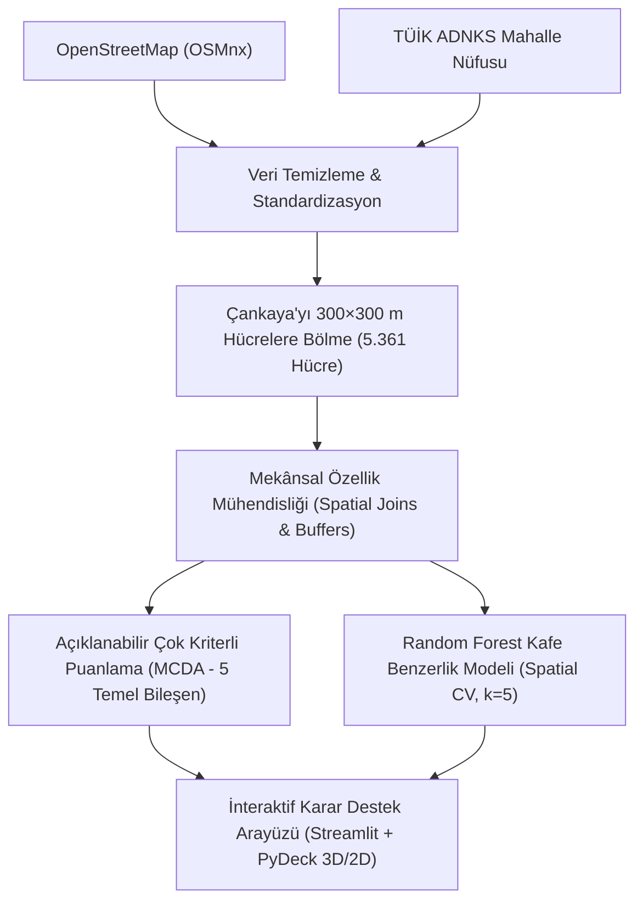

# Perakende Konum Zekası (Retail Location Intelligence)

**Çankaya (Ankara) İçin Veri Odaklı ve Açıklanabilir Kafe Konum Karar Destek Sistemi**

Bu proje, açık kaynaklı coğrafi veriler (OpenStreetMap) ve nüfus verileri (TÜİK ADNKS) kullanarak Ankara'nın Çankaya ilçesinde potansiyel kafe açılış lokasyonlarını değerlendiren ve sıralayan **açıklanabilir bir mekânsal karar destek sistemidir**.

> ⚠️ **Bu proje neyi iddia etmez?**  
> Bu sistem bir **"kârlılık tahmini"** veya **"başarı garantisi"** modeli değildir. Projede işletmelere ait ciro, kâr marjı, kira maliyeti, ayak trafiği (footfall) veya kapanan/batan işletme etiketleri bulunmamaktadır. Dolayısıyla amaç kârlılık vadetmek değil; yaya erişimi, toplu taşıma, potansiyel talep, mahalle nüfusu ve rekabet doygunluğunu şeffaf bir puanlama matrisiyle karar vericiye sunmaktır.

---

## 📌 Temel Felsefe ve Yaklaşım

- **Mevcut Kafe $\neq$ Başarılı Kafe:** Bir hücrede halihazırda kafe bulunması o işletmenin başarılı veya kârlı olduğu anlamına gelmez. Benzer şekilde, içinde kafe olmayan bir hücre otomatik olarak "kötü" veya "boş fırsat" değildir.
- **Çift Katmanlı Değerlendirme:**
  1. **Açıklanabilir Kriter Bazlı Puanlama (MCDA):** Huff (1964) yerçekimi modeli ve perakende literatürüne dayalı 5 temel bileşen (0–100 puan).
  2. **Kafe Benzerlik Modeli (Random Forest):** Mevcut kafelerin bulunduğu bölgelerin mekânsal karakteristiklerini öğrenen ve yeni bölgeleri bu dokuya göre kıyaslayan bir karşılaştırma katmanı.

---

## 🏗️ Sistem Mimarisi ve Veri Akışı


```mermaid
flowchart TD
    A["OpenStreetMap (OSMnx)"] --> B["Veri Temizleme & Standardizasyon"]
    T["TÜİK ADNKS Mahalle Nüfusu"] --> B
    B --> C["Çankaya'yı 300×300 m Hücrelere Bölme (5.361 Hücre)"]
    C --> D["Mekânsal Özellik Mühendisliği (Spatial Joins & Buffers)"]
    D --> E["Açıklanabilir Çok Kriterli Puanlama (MCDA - 5 Temel Bileşen)"]
    D --> F["Random Forest Kafe Benzerlik Modeli (Spatial CV, k=5)"]
    E --> G["İnteraktif Karar Destek Arayüzü (Streamlit + PyDeck 3D/2D)"]
    F --> G
```

---

## 📊 Veri Kaynakları

| Kaynak | Kullanım Amacı | Kapsam & Durum |
| --- | --- | --- |
| **OpenStreetMap (OSMnx)** | İlçe sınırı; kafeler, restoranlar, üniversiteler, okullar, hastaneler, parklar, mağazalar (`shop=*`); otobüs durakları, metro istasyonları, yol ağı ve kesişimler | Aktif kullanımda (10+ katman) |
| **TÜİK ADNKS** | Mahalle bazlı toplam nüfusun hücrelere alansal ağırlıkla (`areal-weighting`) dağıtımı | Aktif kullanımda (Sakarya Mah. medyan interpolasyonu ile) |
| **ABB (Şeffaf Ankara)** | EGO otobüs biniş verileri, sefer sıklıkları, belediye Wi-Fi ve sosyal tesisler | Gelecek yol haritası (Planlandı) |

*Not: Kampüsler, büyük şehir parkları ve hastaneler gibi poligon geometriler mekânsal sayımlardan önce ağırlık merkezlerine (centroid) indirgenmiştir.*

---

## 📅 Proje Gelişim Takvimi ve Durum

| Hafta | Odak Noktası | Durum |
| :---: | :--- | :---: |
| **1** | Çankaya için OpenStreetMap veri toplama altyapısı ve POI sınıflandırması | ✅ Tamamlandı |
| **2** | 300 m hücre ızgarası (Grid) ve mekânsal tampon özellikleri (buffer joins) | ✅ Tamamlandı |
| **3** | Ağırlıklı uygunluk skoru (MCDA), duyarlılık analizi ve açıklanabilirlik paneli | ✅ Tamamlandı |
| **4** | Random Forest kafe benzerlik modeli (Mahalle bazlı Spatial Cross-Validation) | ✅ Tamamlandı |
| **5** | İnteraktif harita, dinamik filtreler, 28 birim testi, Docker ve CI/CD entegrasyonu | ✅ Tamamlandı |

---

## 📐 Puanlama Metodolojisi (MCDA)

Haritadaki her bir 300×300 m hücre için 5 bağımsız alt bileşen (0–1 aralığında) hesaplanır ve ardından ikinci aşama Min–Max normalizasyonuyla dengelenerek 0–100 arası **Uygunluk Puanı** oluşturulur:

$$\text{Uygunluk Puanı} = 100 \times (0.30D + 0.25A + 0.20P + 0.15T + 0.10S)$$

| Bileşen | Ağırlık | İçerik ve Hesaplama Yöntemi | Literatür Gerekçesi |
| --- | :---: | --- | --- |
| **D (Potansiyel Talep)** | %30 | Üniversiteler (1 km), mağazalar (500 m), parklar (500 m), okullar (750 m) ve POI çeşitliliği | Huff (1964) yerçekimi modeli: Çekim merkezleri ziyaretçi akışının ana belirleyicisidir. |
| **A (Ulaşım ve Yaya Erişimi)** | %25 | Otobüs durakları (400 m), metroya yürüme mesafesinin tersi ve yol kesişimleri | Kafe kolaylık/uğrak malıdır; erişilemeyen noktalarda talep realize olamaz. |
| **P (Nüfus Yoğunluğu)** | %20 | Mahalle toplam nüfusunun hücre alansal payıyla dağıtımı | Taban talep seviyesidir; veri mahalle düzeyinde olduğundan haritayı tek başına domine etmez. |
| **T (Tamamlayıcı İşletmeler)** | %15 | Yakın restoran ve fast-food noktaları, mağazalar (kafeler hariç) | Pozitif kümelenme (agglomeration) etkisi; canlı karma kullanımlı sokaklar. |
| **S (Fırsat ve Doygunluk)** | %10 | $\text{Bağıl Doygunluk} = \frac{\text{Kafeler (500 m)}}{\text{Talep Vekili} + 1}$ oranının tersi | Rekabet önemlidir ancak içinde hiç kafe olmayan yer otomatik fırsat değildir (talep de olmayabilir). |

> **Duyarlılık Analizi (Sensitivity Analysis):** Kullanıcı ağırlıkları sidebar'dan değiştirebilir. Sistem ayrıca her ağırlığa tek tek uygulanan $\pm\%10$'luk şoklar altında **Spearman sıra korelasyonunu** ve ilk 50 hücre örtüşmesini anlık olarak raporlar.

---

## 🤖 Random Forest Kafe Benzerlik Modeli (Hafta 4)

- **Hedef:** Hücrenin mevcut kafe bulunan yerlere olan mekânsal benzerlik olasılığı (`cafe_similarity_score`, 0–100).
- **Hedef Değişken:** `cafes_500m >= 1` (ikili sınıflandırma). *Veri sızıntısını (leakage) önlemek için kafe sayısı özellik matrisinden çıkarılmıştır.*
- **Doğrulama Yöntemi:** Komşu hücreler benzer özellik taşıdığından standart K-Fold mekânsal sızıntı (spatial leakage) yaratır. Bu nedenle **Mahalle Gruplu Stratified K-Fold (5 Katlamalı)** uygulanmıştır.
- **Model Başarısı:** **0.979 ROC-AUC** (5 katlamalı uzamsal çapraz doğrulama ortalaması).
- **Gini Özellik Önemleri (Top Özellikler):**
  1. POI Çeşitliliği (%30.2)
  2. Mağazalar 500 m (%15.4)
  3. Restoranlar 500 m (%15.0)
  4. Metro Mesafesi (%10.7)
  5. Parklar 500 m (%8.4)

---

## 🧪 Birim Testleri (Unit Tests)

Projede puanlama formüllerini, ağırlık normalizasyonunu, sınır kontrollerini ve makine öğrenimi boru hattını doğrulayan kapsamlı bir test paketi (`pytest`) bulunmaktadır:

```bash
pytest tests/ -v
```

```text
============================= test session starts =============================
collected 28 items

tests/test_cafe_similarity.py ...........                                [ 39%]
tests/test_scoring.py .................                                  [100%]

============================= 28 passed in 5.36s ==============================
```

- `test_scoring.py`: Ağırlık toplamının 1'e eşitliği, negatif ağırlık budaması, 5 pillar'ın 0–1 aralığı ve rescaling sonrası tavan puanın 50'yi aşması, Spearman duyarlılığı ve sıralama kararlılığı.
- `test_cafe_similarity.py`: Hedef ikililiği, veri sızıntısı olmaması (`cafes_500m` sızıntı kontrolü), 0–100 skor sınırları, CV rapor boyutu ve özellik önemi matrisi.

---

## 🚀 Hızlı Başlangıç

### Gereksinimler
- Python 3.11 veya 3.12 önerilir.
- GDAL / GEOS sistem kütüphaneleri (GeoPandas için).

### 1. Yerel Kurulum
```bash
# Depoyu klonlayın
git clone https://github.com/edasaruhan/SIC_AI_17_Capstone_Group_6.git
cd SIC_AI_17_Capstone_Group_6

# Sanal ortam oluşturup aktifleştirin
python -m venv .venv
.venv\Scripts\Activate.ps1       # Windows PowerShell
# source .venv/bin/activate      # Linux / macOS

# Bağımlılıkları yükleyin
pip install -r requirements.txt
pip install pytest

# Testleri çalıştırın
pytest tests/ -v

# Uygulamayı başlatın
streamlit run app.py
```

### 2. Docker İle Çalıştırma
Uygulama tüm coğrafi bağımlılıkları (GDAL, GEOS, PROJ) içeren hazır bir `Dockerfile` ile paketlenmiştir:

```bash
# İmajı derleyin
docker build -t retail-location-ai .

# Konteyneri başlatın
docker run -p 8501:8501 retail-location-ai
```
Tarayıcınızda `http://localhost:8501` adresine gidin.

---

## 📁 Proje Dizin Yapısı

```text
SIC_AI_17_Capstone_Group_6/
├── .github/
│   └── workflows/
│       └── ci.yml               # GitHub Actions otomatik test iş akışı
├── data/
│   ├── raw/                     # Ham GeoJSON dosyaları (OSM katmanları, sınırlar)
│   └── processed/               # İşlenmiş grid özellikleri (cankaya_grid_features.parquet)
├── src/
│   ├── __init__.py
│   ├── collect_osm_data.py      # Overpass API üzerinden OSM POI ve yol ağı indirme
│   ├── create_grid.py           # 300x300 metre mekânsal hücre ızgarası üretimi
│   ├── build_features.py        # Mekânsal join'ler ve özellik mühendisliği
│   ├── allocate_population.py   # TÜİK nüfusunun alansal interpolasyonu (Sakarya Mah. medyan dahil)
│   ├── tuik.py                  # TÜİK ADNKS mahalle tablosu yükleme ve anahtar eşleme
│   ├── attach_streets.py        # Hücrelere en yakın OSM cadde/sokak adını etiketleme
│   ├── scoring.py               # 5 Temel Bileşen (Pillar), rescaling, ağırlıklandırma, duyarlılık
│   ├── cafe_similarity.py       # Random Forest Kafe Benzerlik Modeli (Spatial Group CV)
│   └── visualization.py         # PyDeck 2D/3D interaktif harita ve bilgi baloncukları
├── tests/
│   ├── __init__.py
│   ├── test_scoring.py          # MCDA ve puanlama testleri (17 test)
│   └── test_cafe_similarity.py  # RF benzerlik modeli testleri (11 test)
├── app.py                       # Streamlit web arayüzü ve karar destek paneli
├── Dockerfile                   # Üretim ortamı için konteyner tanımı
├── requirements.txt             # Python bağımlılıkları
└── README.md
```

---

## ⚠️ Bilinen Sınırlılıklar

1. **Talep Göstergeleri Birer Vekildir (Proxy):** Yaya sayımı sensörleri veya anlık GSM yoğunluk verisi olmadığı için talep; okul, üniversite, mağaza ve nüfus yoğunluğu üzerinden modellenmiştir.
2. **Genç Nüfus Kırılımı (15–34 Yaş):** TÜİK ADNKS verilerinde mahalle düzeyinde yaş kırılımı açık kaynak yayımlanmadığı için mahalle toplam nüfusu kullanılmıştır.
3. **OpenStreetMap Tamlığı:** Çankaya genel olarak iyi haritalanmış olsa da yeni açılan işletmeler veya küçük sokak kafeleri OSM üzerinde eksik kalabilmektedir.
4. **Coğrafi Kapsam:** Mevcut veri boru hattı Çankaya ilçesi için kurgulanmıştır.

---

## 📜 Lisans

Bu proje [MIT Lisansı](LICENSE) altında lisanslanmıştır.  
OpenStreetMap verileri © OpenStreetMap katkıcılarına aittir ve [ODbL](https://www.openstreetmap.org/copyright) altında sunulmaktadır.
