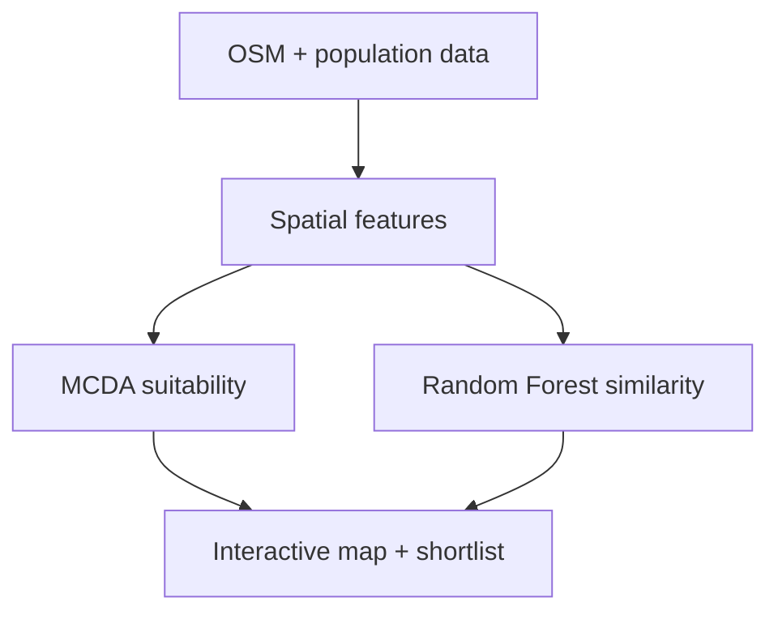

# Retail Location Intelligence

### Explainable café site selection in Çankaya, Ankara
**Samsung Innovation Campus — AI in Marketing Capstone Project · Group 6**

[English](README.md) · [Türkçe](README_TR.md)

An AI-supported market planning tool that aims to help café entrepreneurs shortlist candidate areas faster by comparing access to their intended customer surroundings and competition.

Population, nearby institutions and transport are indirect access indicators. The project does not observe customer preferences, segment membership or actual footfall.

> **Purpose:** compare locations transparently. Scores do not predict revenue, profit or business success.

## 1. The Problem

Choosing a café location requires balancing nearby activity, accessibility, residential population and competition. These signals are scattered across maps and datasets, making an initial comparison difficult.

**Proposed business KPI:** reduce the time needed to prepare a candidate-area shortlist compared with a manual map review. This is a future pilot measure; no time saving has been demonstrated.

## 2. Our Solution

The Streamlit dashboard combines two separate perspectives:

| Layer | Question it answers |
| --- | --- |
| **MCDA suitability score** | How does a location rank under the selected demand, access, population and competition weights? |
| **Random Forest similarity score** | How closely does it resemble areas with mapped cafés? |

Users can select neighborhoods, adjust weights, compare locations on 2D/3D maps and inspect score contributions.

## 3. Data and Workflow

**Sources:** OpenStreetMap places and street networks, plus a neighborhood population CSV labeled TÜİK ADNKS 2025.

**Committed snapshot:** 5,361 cells in a 300 m grid, with 121 neighborhood labels. Population is distributed by overlapping area; it is a residential proxy, not measured footfall.


```mermaid
flowchart TD
    A["OSM + population data"] --> B["Spatial features"]
    B --> C["MCDA suitability"]
    B --> D["Random Forest similarity"]
    C --> E["Interactive map + shortlist"]
    D --> E
```

## 4. Scoring and AI

**Suitability:** demand 45%, access 25% and population 20% form the positive contribution. Restaurant saturation deducts up to 3 points; café competition deducts up to 7 points. Positive weights normalize within their own total; the final score is clipped to 0–100.

Weights are user-selected scenarios, not coefficients learned from commercial outcomes. Popularity compatibility is planned and currently disabled.

**Similarity:** Random Forest uses 300 trees and five-fold cross-validation grouped by neighborhood. The target is at least one mapped café within 500 m. Direct café counts and café-containing diversity are excluded from model inputs; missing-value medians are fitted within each training fold. Displayed scores use held-out predictions only.

## 5. Results and Validation

| Evidence | Recorded result |
| --- | --- |
| Corrected spatial validation | **Mean fold ROC-AUC: 0.960** |
| Software checks after the model fixes | **43 tests passed on Python 3.11 and 3.12** |
| Commercial impact | Not yet measured |

The validation uses the committed snapshot without an OSM refresh. ROC-AUC measures discrimination for mapped café presence, not profitability. See [validation details](docs/model_validation.md).

## 6. Current Status and Limits

- **Implemented:** café analysis, maps, filters, adjustable scoring, similarity, tests and Docker configuration.
- **Provisional data:** the committed snapshot lacks raw café coordinates and newer demand/competition layers; missing penalties are disclosed and affected scores are marked provisional.
- **Refresh required:** newer school counts require explicit ISCED 2/3 tags; the committed counts are generic. OSM refresh needs working external services.
- **Evaluation limit:** neighborhood holdouts can still share spatial buffers across borders; no independent external test set is recorded.
- **Deployment:** local/self-hosted prototype; a live public service and successful container deployment are not verified.
- **Field checks:** OSM completeness, rents, pedestrian activity and customer fit must be assessed before investment.

## 7. Run the App

Use **Python 3.11 or 3.12**.

```bash
git clone https://github.com/edasaruhan/SIC_AI_17_Capstone_Group_6.git
cd SIC_AI_17_Capstone_Group_6
python -m venv .venv
```

Activate the environment:

| Platform | Command |
| --- | --- |
| macOS / Linux | `source .venv/bin/activate` |
| Windows PowerShell | `.venv\Scripts\Activate.ps1` |

```bash
python -m pip install -r requirements.txt
python -m streamlit run app.py
```

Open **http://localhost:8501**. Spatial-library installation depends on the platform and available package wheels.

Optional tests: `python -m pip install pytest`, then `python -m pytest tests/ -v`.

Optional Docker: `docker build -t retail-location-intelligence .`, then `docker run -p 8501:8501 retail-location-intelligence`.

## 8. Capstone Reports

[Five-minute capstone presentation](docs/Capstone_Presentation.pptx) — English slides with Turkish speaker notes.

| Assignment | English PDF |
| --- | --- |
| 1 | [Literature, data and technology review](docs/assignments/Assignment_1_Review.pdf) |
| 2 | [Model refinement and testing](docs/assignments/Assignment_2_Refinement_Testing.pdf) |
| 3 | [Literature, data and technology review](docs/assignments/Assignment_3_Review.pdf) |
| 4 | [Data preparation and model exploration](docs/assignments/Assignment_4_Preparation_Modeling.pdf) |
| 5 | [Model refinement and testing](docs/assignments/Assignment_5_Refinement_Testing.pdf) |
| 6 | [Deployment](docs/assignments/Assignment_6_Deployment.pdf) |

Assignments 1/3 and 2/5 have the same supplied scope. Reports document implementation commit `58ce550`.

[User guide (Turkish)](docs/temel_kullanim.md) · [Data dictionary](data/data_dictionary.md)

**License:** [MIT](LICENSE). Map data © [OpenStreetMap contributors](https://www.openstreetmap.org/copyright), ODbL.

