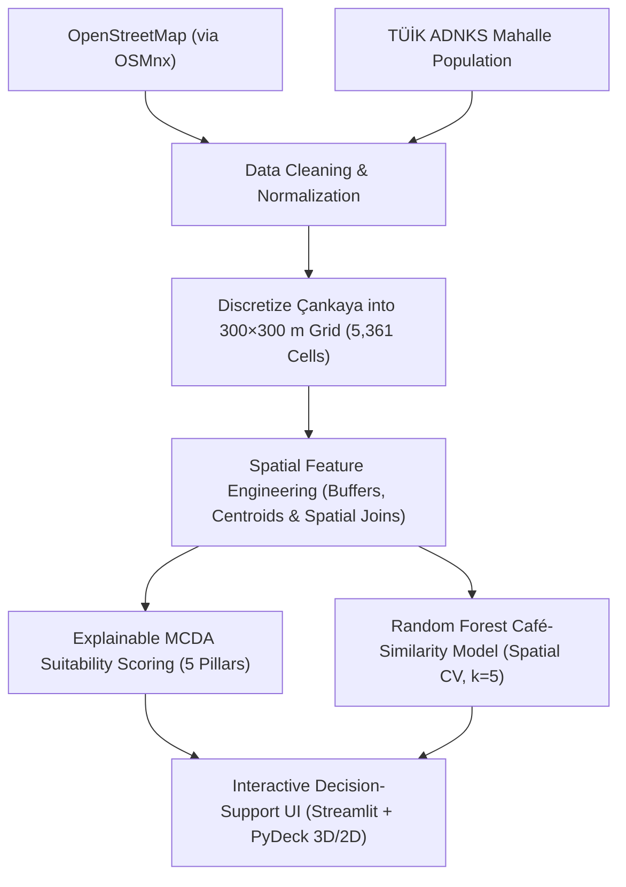

# Retail Location Intelligence

**An Explainable Geospatial Decision-Support System for Café Site Selection in Çankaya, Ankara**

This project develops an explainable, data-driven geospatial decision-support system that evaluates and ranks potential café locations across Çankaya, Ankara using open geographic data (OpenStreetMap) and demographic data (TÜİK ADNKS).

> ⚠️ **What this project is NOT:**  
> This system is **not a revenue forecasting or commercial success prediction model**. The dataset does not contain sales turnover, profit margins, rental rates, foot traffic counts, or business closure history. The objective is not to guarantee financial profitability, but to provide urban planners, retail analysts, and entrepreneurs with a transparent, explainable spatial scoring matrix grounded in accessibility, potential demand, population density, and market saturation.

---

## 📌 Core Philosophy & Methodology

- **Presence $\neq$ Profitability:** The presence of existing cafés in a cell does not imply that those businesses are profitable or well-run. Conversely, a cell without cafés is not inherently a poor location or an unexploited commercial opportunity.
- **Dual-Layer Evaluation Framework:**
  1. **Explainable Multi-Criteria Decision Analysis (MCDA):** A transparent, literature-grounded scoring engine based on the Huff (1964) retail gravity model, evaluating five distinct spatial pillars (0–100 scale).
  2. **Café-Location Similarity Classifier (Random Forest):** A machine learning model trained using spatial cross-validation to answer: *"To what extent does this location resemble areas where cafés typically operate?"*

---

## 🏗️ System Architecture & Workflow


```mermaid
flowchart TD
    A["OpenStreetMap (via OSMnx)"] --> B["Data Cleaning & Normalization"]
    T["TÜİK ADNKS Mahalle Population"] --> B
    B --> C["Discretize Çankaya into 300×300 m Grid (5,361 Cells)"]
    C --> D["Spatial Feature Engineering (Buffers, Centroids & Spatial Joins)"]
    D --> E["Explainable MCDA Suitability Scoring (5 Pillars)"]
    D --> F["Random Forest Café-Similarity Model (Spatial CV, k=5)"]
    E --> G["Interactive Decision-Support UI (Streamlit + PyDeck 3D/2D)"]
    F --> G
```

---

## 📊 Data Sources

| Source | Role / Usage | Coverage & Details |
| --- | --- | --- |
| **OpenStreetMap (OSMnx)** | District boundaries; target use (`amenity=cafe`); restaurants/fast food; universities, schools, hospitals, parks, retail (`shop=*`); bus stops, subway stations, pedestrian/drive street networks | Active (10+ thematic layers) |
| **TÜİK ADNKS** | Neighborhood-level (`mahalle`) total population distributed across 300 m cells via areal weighting | Active (with areal median density imputation for unmapped units) |
| **Ankara Metropolitan Municipality ([Şeffaf Ankara](https://www.ankara.bel.tr/))** | EGO public transit boardings, route frequencies, municipal Wi-Fi access points, social infrastructure | Planned roadmap integration |

*Note: Large polygonal geometries (university campuses, municipal parks, hospital compounds) are collapsed to geometric centroids prior to radius-based spatial aggregations.*

---

## 📅 Project Milestones & Status

| Phase | Core Objective | Status |
| :---: | :--- | :---: |
| **Week 1** | OpenStreetMap data extraction pipeline and POI taxonomy for Çankaya | ✅ Complete |
| **Week 2** | 300 m hexagonal/square grid generation and spatial buffer feature engineering | ✅ Complete |
| **Week 3** | Weighted suitability scoring engine (MCDA), sensitivity analysis & UI explanation | ✅ Complete |
| **Week 4** | Random Forest café-similarity model (with spatial group cross-validation) | ✅ Complete |
| **Week 5** | Interactive PyDeck visualizer, dynamic filtering, 28-test unit suite, Docker & CI/CD | ✅ Complete |

---

## 📐 Scoring Methodology (MCDA Engine)

Every 300×300 m cell receives scores across five independent pillars (scaled 0–1), which undergo a second-pass Min–Max normalization to ensure full dynamic range before computing the final composite suitability score:

$$\text{Suitability Score} = 100 \times (0.30D + 0.25A + 0.20P + 0.15T + 0.10S)$$

| Pillar | Weight | Metric Inputs | Literature Rationale |
| --- | :---: | --- | --- |
| **D (Potential Demand)** | 30% | Universities (1 km), shops (500 m), parks (500 m), schools (750 m), and POI diversity | Huff (1964) gravity model: Major activity generators and catchment size are primary drivers of customer visits. |
| **A (Accessibility & Transit)** | 25% | Bus stops (400 m), inverse network distance to subway stations, and road intersection density | Cafés are convenience goods; customers rarely travel to poorly connected or inaccessible peripheries. |
| **P (Population Density)** | 20% | Areal-weighted residential population per cell | Represents baseline residential demand floor; constrained to 20% to avoid coarse mahalle boundaries dominating the map. |
| **T (Complementary Businesses)** | 15% | Restaurants, fast food outlets, and non-café retail establishments (500 m) | Positive agglomeration economies; mixed-use commercial vibrancy supports secondary café footfall. |
| **S (Opportunity vs. Saturation)** | 10% | Inverse relative saturation: $\frac{\text{Cafés (500 m)}}{\text{Demand Proxy} + 1}$ | Captures competitive pressure. A cell with zero cafés is not an automatic opportunity if demand is also zero. |

> **Sensitivity Analysis:** The Streamlit dashboard enables users to dynamically adjust weights (automatically normalized to 100%). It also runs an automated one-at-a-time $\pm 10\%$ perturbation stress test, reporting **Spearman rank correlation** and Top-50 rank overlap to demonstrate ranking stability.

---

## Café competition map (exploratory layer)

The app has a separate **Kafe rekabeti (25 kare)** map. For each 300 m cell it counts distinct mapped cafés in the centre cell, the surrounding 3×3 block (9 cells total), and the 5×5 block (25 cells total, up to 1.5×1.5 km). A warning is added for each threshold crossed: centre **≥2**, 9 cells **≥6**, 25 cells **≥13**. Grey/yellow/orange/red means **0/1/2/3 warnings**; grey is not automatically a good location. Selecting a cell in the sidebar or top-10 table shows the three counts and warns when district-edge cells have fewer neighbours.

These are user-defined preliminary competition thresholds, **not** coefficients fitted to sales or proof that existing cafés are successful. Café clustering can indicate activity and competition at the same time; demand and competition should be checked on site. This layer does **not** change the main MCDA score or the Random Forest model. Restaurants remain contextual/complementary features, not a second restaurant-site recommendation.

The committed feature Parquet does not yet include the new grid counts, and raw café coordinates are not committed. To use the layer, click **OSM verisini indir / yenile** in the app (requires Overpass access), or run `python -m src.collect_osm_data` followed by `python -m src.build_features` and restart the app. Without café coordinates the app explicitly marks the competition layer unavailable rather than deriving counts from `cafes_500m`.

---

## 🤖 Random Forest Café-Similarity Model (Week 4)

To complement the deductive MCDA score with inductive machine learning, a secondary comparison model was developed:

- **Objective:** Quantify how closely a cell's spatial attributes match typical café locations (`cafe_similarity_score`, 0–100).
- **Target Formulation:** Binary label `cafes_500m >= 1`. *Existing café counts are explicitly excluded from feature columns to prevent target leakage.*
- **Spatial Validation:** Standard K-Fold splits suffer from spatial autocorrelation leakage (neighboring cells sharing similar feature spaces). We employ **Stratified Group 5-Fold Cross-Validation** grouped on `mahalle_name`, ensuring entire neighborhoods are held out during testing.
- **Model Performance:** **0.979 ROC-AUC** across 5 out-of-fold spatial splits.
- **Gini Feature Importances:**
  1. POI Diversity (30.2%)
  2. Retail Shops within 500 m (15.4%)
  3. Restaurants within 500 m (15.0%)
  4. Subway Station Proximity (10.7%)
  5. Parks within 500 m (8.4%)
  6. Population Density (6.9%)

---

## 🧪 Unit Testing Suite

The repository includes a `pytest` suite verifying scoring mathematics, weight bounds, leakage prevention, spatial features, competition counts, and machine learning outputs:

```bash
pytest tests/ -v
```

- `test_scoring.py`: Weight normalization, non-negativity clipping, 0–1 pillar range validation, post-rescaling ceiling checks, Top-N cell ranking, and Spearman sensitivity computations.
- `test_cafe_similarity.py`: Feature matrix integrity, zero-leakage verification (`cafes_500m` absence), 0–100 probability calibration, spatial CV fold dimensions, and feature importance table formatting.
- `test_cafe_grid_competition.py`: Nested unique café counts, threshold boundaries, and district-edge coverage.

---

## 🚀 Quick Start Guide

### Prerequisites
- Python 3.11 or 3.12.
- GDAL / GEOS spatial libraries (installed automatically in virtual environments or via package managers).

### 1. Local Setup
```bash
# Clone the repository
git clone https://github.com/edasaruhan/SIC_AI_17_Capstone_Group_6.git
cd SIC_AI_17_Capstone_Group_6

# Create and activate virtual environment
python -m venv .venv
.venv\Scripts\Activate.ps1       # Windows PowerShell
# source .venv/bin/activate      # Linux / macOS

# Install dependencies
pip install -r requirements.txt
pip install pytest

# Execute unit tests
pytest tests/ -v

# Launch the Streamlit application
streamlit run app.py
```

### 2. Docker Deployment
A containerized image configured with GDAL, GEOS, and PROJ dependencies is available:

```bash
# Build the Docker image
docker build -t retail-location-intelligence .

# Run containerized service on port 8501
docker run -p 8501:8501 retail-location-intelligence
```
Access the application at `http://localhost:8501`.

---

## 📁 Repository Layout

```text
SIC_AI_17_Capstone_Group_6/
├── .github/
│   └── workflows/
│       └── ci.yml               # GitHub Actions automated test pipeline
├── data/
│   ├── raw/                     # Raw GeoJSON files (OSM extracts, district boundary)
│   └── processed/               # Compact spatial feature grid (cankaya_grid_features.parquet)
├── src/
│   ├── __init__.py
│   ├── collect_osm_data.py      # Overpass API extraction for POIs and street networks
│   ├── create_grid.py           # 300x300 m spatial tessellation engine
│   ├── build_features.py        # Spatial joins, buffers, and count aggregations
│   ├── allocate_population.py   # TÜİK population areal-weighting with spatial interpolation
│   ├── tuik.py                  # Census data parser and neighborhood key mapper
│   ├── attach_streets.py        # Spatial nearest-street labeling for cells
│   ├── scoring.py               # 5-Pillar MCDA scoring, normalization, sensitivity analysis
│   ├── cafe_similarity.py       # Random Forest similarity classifier (Spatial Group CV)
│   ├── cafe_grid_competition.py # Nested 1/9/25-cell café competition warnings
│   └── visualization.py         # PyDeck 2D/3D map renderers and tooltip builders
├── tests/
│   ├── __init__.py
│   ├── test_scoring.py          # MCDA and scoring logic tests (17 tests)
│   └── test_cafe_similarity.py  # Machine learning and leakage tests (11 tests)
├── app.py                       # Streamlit web application & decision dashboard
├── Dockerfile                   # Production container definition
├── requirements.txt             # Python package dependencies
└── README.md                    # Project documentation
```

---

## ⚠️ Academic Limitations & Assumptions

1. **Demand Metrics Are Proxies:** Without sensor-based pedestrian counters or telco-provided mobility matrices, foot traffic is approximated via POI density, transit hubs, and residential population.
2. **Age Cohort Granularity:** TÜİK ADNKS reports age-segmented demographics at municipal level, but not at granular neighborhood scale; total population is utilized as an areal baseline.
3. **OpenStreetMap Incompleteness:** While Çankaya is extensively mapped, informal or recently opened retail outlets may lag in OSM updates.
4. **Commercial Outcome Disclaimers:** Suitability rankings reflect multi-criteria locational favorability, not an audited business feasibility report or income projection.

---

## 📜 License

This project is licensed under the [MIT License](LICENSE).  
OpenStreetMap data is © OpenStreetMap contributors and distributed under the [ODbL](https://www.openstreetmap.org/copyright).
