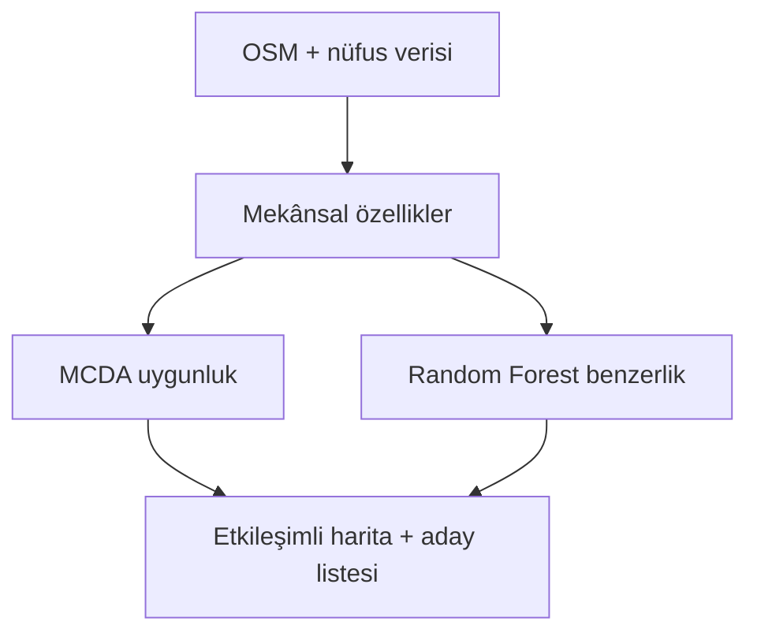

# Retail Location Intelligence

### Çankaya, Ankara’da açıklanabilir kafe yeri seçimi
**Samsung Innovation Campus — AI in Marketing Capstone Projesi · Grup 6**

[English](README.md) · [Türkçe](README_TR.md)

Kafe girişimcilerinin hedef müşteri çevresine erişim ve rekabet koşullarını karşılaştırarak aday bölgeleri daha hızlı seçmesini amaçlayan AI destekli pazar planlama aracı.

Nüfus, çevredeki kurumlar ve ulaşım dolaylı erişim göstergeleridir. Proje müşteri tercihini, segment üyeliğini veya gerçek yaya sayısını gözlemlemez.

> **Amaç:** Konumları şeffaf biçimde karşılaştırmak. Puanlar gelir, kâr veya işletme başarısı tahmini değildir.

## 1. Problem

Kafe yeri seçimi; çevredeki etkinlik, erişilebilirlik, yerleşik nüfus ve rekabeti birlikte değerlendirmeyi gerektirir. Dağınık harita ve veri kaynakları ilk karşılaştırmayı zorlaştırır.

**Önerilen ticari KPI:** Manuel harita incelemesine kıyasla aday bölge listesi hazırlama süresini azaltmak. Bu, gelecekteki pilotun ölçütüdür; henüz süre tasarrufu kanıtlanmamıştır.

## 2. Çözüm

Streamlit paneli iki ayrı bakış açısı sunar:

| Katman | Yanıtladığı soru |
| --- | --- |
| **MCDA uygunluk puanı** | Seçilen talep, erişim, nüfus ve rekabet ağırlıkları altında konum nasıl sıralanır? |
| **Random Forest benzerlik puanı** | Kayıtlı kafelerin bulunduğu bölgelere ne kadar benzer? |

Kullanıcı mahalle seçebilir, ağırlıkları değiştirebilir, 2D/3D haritalarda konumları karşılaştırabilir ve puan katkılarını inceleyebilir.

## 3. Veri ve İş Akışı

**Kaynaklar:** OpenStreetMap yer ve yol ağı verileri ile TÜİK ADNKS 2025 etiketli mahalle nüfus CSV’si.

**Kayıtlı veri:** 300 m ızgarada 5.361 hücre ve 121 mahalle etiketi. Nüfus kesişim alanına göre dağıtılır; yerleşik nüfus göstergesidir, ölçülmüş yaya trafiği değildir.



## 4. Puanlama ve Yapay Zekâ

**Uygunluk:** Talep %45, erişim %25 ve nüfus %20 olumlu katkıyı oluşturur. Restoran doygunluğu en fazla 3, kafe rekabeti en fazla 7 puan düşürür. Olumlu ağırlıklar kendi toplamlarına bölünür; sonuç 0–100 aralığında tutulur.

Ağırlıklar kullanıcı senaryolarıdır, ticari sonuçlardan öğrenilmiş katsayılar değildir. Popülerlik uyumu planlıdır ve şu an kapalıdır.

**Benzerlik:** Random Forest, 300 ağaç ve mahalle bazında gruplu beş katlı çapraz doğrulama kullanır. Hedef, 500 m içinde en az bir kayıtlı kafedir. Doğrudan kafe sayıları ve kafe içeren çeşitlilik girdilerden çıkarılır; eksik değer medyanları her eğitim katında öğrenilir. Gösterilen puanlar yalnızca ayrı tutulan hücrelerin tahminlerinden hesaplanır.

## 5. Sonuçlar ve Doğrulama

| Kanıt | Kayıtlı sonuç |
| --- | --- |
| Düzeltilmiş mekânsal doğrulama | **Ortalama kat ROC-AUC: 0,960** |
| Model düzeltmeleri sonrası yazılım kontrolleri | **Python 3.11 ve 3.12’de 43 test geçti** |
| Ticari etki | Henüz ölçülmedi |

Doğrulama OSM yenilenmeden kayıtlı veriyle yapılmıştır. ROC-AUC kafe varlığını ayırt etmeyi ölçer, kârlılığı değil. [Doğrulama ayrıntıları](docs/model_validation.md).

## 6. Mevcut Durum ve Sınırlılıklar

- **Uygulandı:** Kafe analizi, haritalar, filtreler, ayarlanabilir puanlama, benzerlik, testler ve Docker yapılandırması.
- **Geçici veri:** Kayıtlı veri ham kafe koordinatlarını ve yeni talep/rekabet katmanlarını içermez; eksik cezalar açıklanır, etkilenen puanlar geçici işaretlenir.
- **Yenileme gerekli:** Yeni okul sayımları açık ISCED 2/3 etiketi ister; kayıtlı sayımlar geneldir. OSM yenilemesi çalışan dış hizmetlere bağlıdır.
- **Değerlendirme sınırı:** Ayrı mahalleler sınırda tampon paylaşabilir; bağımsız dış test kümesi kaydı yoktur.
- **Yayın:** Yerel/kendi sunucunda prototip; canlı açık hizmet ve başarılı konteyner yayını doğrulanmamıştır.
- **Saha kontrolü:** Yatırım öncesi OSM kapsamı, kira, yaya hareketi ve müşteri uyumu incelenmelidir.

## 7. Uygulamayı Çalıştırma

**Python 3.11 veya 3.12** kullanın.

```bash
git clone https://github.com/edasaruhan/SIC_AI_17_Capstone_Group_6.git
cd SIC_AI_17_Capstone_Group_6
python -m venv .venv
```

Ortamı etkinleştirin:

| Platform | Komut |
| --- | --- |
| macOS / Linux | `source .venv/bin/activate` |
| Windows PowerShell | `.venv\Scripts\Activate.ps1` |

```bash
python -m pip install -r requirements.txt
python -m streamlit run app.py
```

**http://localhost:8501** adresini açın. Mekânsal kütüphane kurulumu platforma ve hazır paketlere bağlıdır.

İsteğe bağlı test: `python -m pip install pytest`, ardından `python -m pytest tests/ -v`.

İsteğe bağlı Docker: `docker build -t retail-location-intelligence .`, ardından `docker run -p 8501:8501 retail-location-intelligence`.

## 8. Capstone Raporları

[Beş dakikalık capstone sunumu](docs/Capstone_Presentation.pptx) — İngilizce slaytlar ve Türkçe konuşmacı notları.

| Ödev | İngilizce PDF |
| --- | --- |
| 1 | [Literatür, veri ve teknoloji incelemesi](docs/assignments/Assignment_1_Review.pdf) |
| 2 | [Model iyileştirme ve test](docs/assignments/Assignment_2_Refinement_Testing.pdf) |
| 3 | [Literatür, veri ve teknoloji incelemesi](docs/assignments/Assignment_3_Review.pdf) |
| 4 | [Veri hazırlama ve model keşfi](docs/assignments/Assignment_4_Preparation_Modeling.pdf) |
| 5 | [Model iyileştirme ve test](docs/assignments/Assignment_5_Refinement_Testing.pdf) |
| 6 | [Yayınlama](docs/assignments/Assignment_6_Deployment.pdf) |

Ödev 1/3 ve 2/5 aynı kapsamı paylaşır. Teknik raporlar `58ce550` uygulama sürümüne dayanır.

[Kullanım rehberi](docs/temel_kullanim.md) · [Veri sözlüğü](data/data_dictionary.md)

**Lisans:** [MIT](LICENSE). Harita verisi © [OpenStreetMap katkıcıları](https://www.openstreetmap.org/copyright), ODbL.
